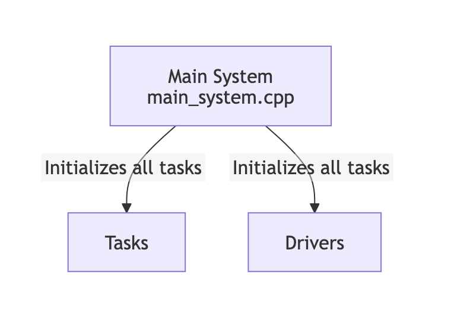
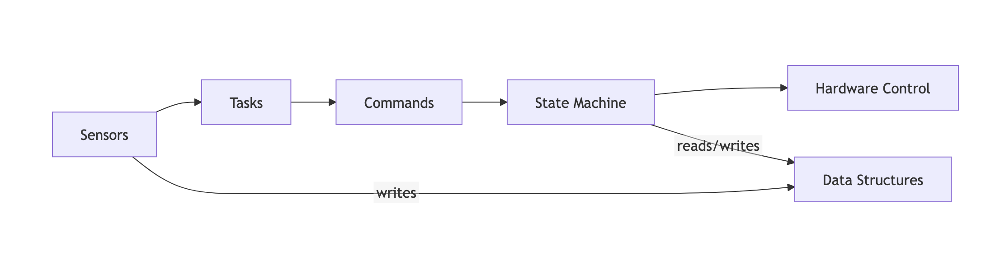
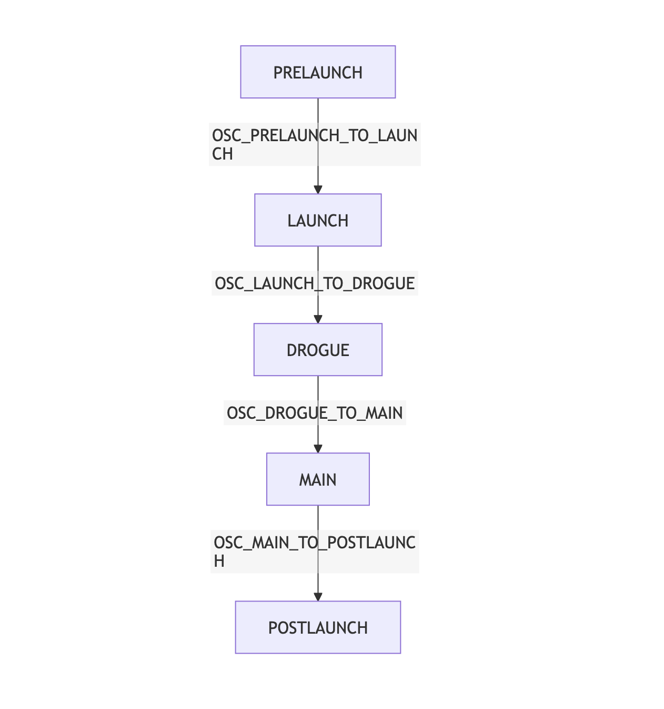

# Ares Payload
---
1. **Update:** Dec 19, 2025
2. **Author:** Mann Patel
---

Note: Documentation reflects the Osiris Payload

## Table of Contents
  1. [Ares Payload](#ares-payload)
  2. [System Architecture](#system-architecture)
  3. [Data Flow](#data-flow)
  4. [Task Details](#task-details)
  5. [State Machine Details](#state-machine-details)
  6. [Communication Interfaces](#communication-interfaces)
  7. [Getting Started](#getting-started)
  8. [Example Usage](#example-usage)
  9. [Key Design Patterns](#key-design-patterns)
  10. [Development Notes](#development-notes)
  11. [Hardware Naming Convention](#hardware-naming-convention)
  12. [Future Enhancements](#future-enhancements)

---

## Overview

The Osiris Payload System is an embedded flight computer designed for rocket payloads. It runs on an STM32H7 microcontroller using FreeRTOS and manages sensor data collection, state transitions, and hardware control throughout a rocket's flight.

## System Architecture

### High-Level Design

The system follows a task-based architecture using FreeRTOS, where different subsystems run as independent tasks that communicate via command queues. A state machine manages the flight phases and controls hardware accordingly.



## Core Components

### 1. **Task System**

The system uses multiple FreeRTOS tasks that run concurrently:

| Task | Priority | Purpose |
|------|----------|---------|
| **FlightTask** | 2 | Main flight logic and state machine coordination |
| **IMUTask** | 2 | Reads IMU (Inertial Measurement Unit) data |
| **BaroTask** | 2 | Reads barometer/pressure sensor data |
| **DebugTask** | 2 | Handles debug output via UART |
| **CubeTask** | 2 | Framework task (Cube++ RTOS wrapper) |

### 2. **State Machine (OsirisSM)**
s
The flight computer transitions through 5 states during operation:

```
PRELAUNCH -> LAUNCH -> DROGUE -> MAIN -> POSTLAUNCH
```

Each state controls different hardware peripherals and responds to different commands.

### 3. **Sensor Drivers**

#### Barometers
- **LPS22HH** (x2): "Mario" and "Luigi" - SPI-based pressure/temperature sensors
- **MS5611** ("Bowser"): I2C-based pressure/temperature sensor

#### IMU (Inertial Measurement Unit)
- **LSM6DSO** (x2): "Toopy" (I2C) and "Binoo" (SPI) - Accelerometer and gyroscope sensors

### 4. **Hardware Control (GPIO)**

The system controls various hardware via GPIO pins:
- **SOL1, SOL2, SOL3**: Solenoid valves
- **COMPRESSOR**: Air compressor control
- **LED_GREEN, LED_BLUE**: Status indicators

## Data Flow


### Command Structure

Tasks communicate using a `Command` object with:
- **Command Type**: REQUEST_COMMAND, DATA_COMMAND, CONTROL_ACTION, etc.
- **Task Command**: Specific action identifier
- **Data Payload**: Optional data (e.g., sensor readings)

### Data Structures

```cpp
typedef struct BarometerData {
    float marioPressure;        // LPS22HH U3
    float marioTemperature;
    float luigiPressure;        // LPS22HH U4
    float luigiTemperature;
    uint32_t bowserPressure;    // MS5611
    uint32_t bowserTemperature;
} BarometerData;

typedef struct IMUData {
    float xAccel;
    float yAccel;
    float zAccel;
} IMUData;
```

## Task Details

### FlightTask
- **Purpose**: Coordinates overall flight logic
- **Key Responsibility**: Manages the OsirisSM state machine
- **Communication**: Receives data from IMUTask and BaroTask

### IMUTask
- **Purpose**: Reads acceleration and gyroscope data
- **Sensors**: LSM6DSO (Toopy on I2C, Binoo on SPI)
- **Commands**:
  - `IMU_REQUEST_LIN_ACC`: Request linear acceleration
  - `IMU_REQUEST_ANG_ACC`: Request angular acceleration
- **Output**: Sends `IMUData` to FlightTask

### BaroTask
- **Purpose**: Reads pressure and temperature data
- **Sensors**:
  - LPS22HH (Mario and Luigi on SPI)
  - MS5611 (Bowser on I2C)
- **Commands**:
  - `BARO_REQUEST_NEW_SAMPLE`: Read all sensors
  - `BARO_REQUEST_DEBUG`: Print sensor values
  - `BARO_REQUEST_FLASH_LOG`: Log data to flash memory
- **Output**: Sends `BarometerData` to FlightTask

### DebugTask
- **Purpose**: Handles UART debug output
- **Interface**: USART6 (accessible via `Driver::uart6`)

## State Machine Details

### State Transitions



### State Behaviors

#### PRELAUNCH
- **Hardware**: All peripherals OFF (safe state)
- **Control**: Can control SOL1, SOL2, SOL3, and COMPRESSOR
- **LED**: Green LED ON
- **Purpose**: Ground operations and testing

#### LAUNCH
- **Hardware**: All peripherals OFF
- **Purpose**: Rocket is ascending
- **Transitions to**: DROGUE (typically at apogee)

#### DROGUE
- **Hardware**: Can control SOL1, SOL2, SOL3, and COMPRESSOR
- **Purpose**: Drogue parachute deployed, descending
- **Transitions to**: MAIN (at specific altitude)

#### MAIN
- **Hardware**: Can control SOL3 and COMPRESSOR only
- **Purpose**: Main parachute deployed
- **Transitions to**: POSTLAUNCH (after landing)

#### POSTLAUNCH
- **Hardware**: All peripherals OFF
- **Purpose**: Landed, safe state

### Emergency Override

From any state, you can return to PRELAUNCH using:
```cpp
OSC_ANY_TO_PRELAUNCH
```

## Communication Interfaces

### SPI (Serial Peripheral Interface)
- **SPI2**: LPS22HH sensors (Mario and Luigi)
- **SPI6**: LSM6DSO sensor (Binoo)

### I2C
- **I2C2**: MS5611 (Bowser) and LSM6DSO (Toopy)

### UART
- **USART6**: Debug output (configured in `Driver::uart6`)

## Getting Started

### System Initialization

The system boots through `main_system.cpp`:

```cpp
void run_main() {
    // 1. Initialize all tasks
    CubeTask::Inst().InitTask();
    DebugTask::Inst().InitTask();
    FlightTask::Inst().InitTask();
    IMUTask::Inst().InitTask();
    BaroTask::Inst().InitTask();

    // 2. Print boot info
    SOAR_PRINT("\n-- SOAR SYSTEM --\n");

    // 3. Test sensors (example)
    Command testIMU(REQUEST_COMMAND, IMU_REQUEST_LIN_ACC);
    IMUTask::Inst().GetEventQueue()->Send(testIMU);

    // 4. Start FreeRTOS scheduler
    osKernelStart();
}
```

### Task Configuration

Task priorities and stack sizes are defined in `SystemDefines.hpp`:

```cpp
// All tasks currently have priority 2
constexpr uint8_t FLIGHT_TASK_RTOS_PRIORITY = 2;
constexpr uint8_t IMU_TASK_RTOS_PRIORITY = 2;
constexpr uint8_t BARO_TASK_RTOS_PRIORITY = 2;

// Stack sizes (in words)
constexpr uint16_t FLIGHT_TASK_STACK_DEPTH_WORDS = 512;
constexpr uint16_t IMU_TASK_STACK_DEPTH_WORDS = 512;
constexpr uint16_t BARO_TASK_STACK_DEPTH_WORDS = 512;
```

## Example Usage

### Requesting IMU Data

```cpp
// Create a command to request linear acceleration
Command cmd(REQUEST_COMMAND, IMU_REQUEST_LIN_ACC);

// Send to IMU task
IMUTask::Inst().GetEventQueue()->Send(cmd);

// IMUTask will respond by sending IMUData to FlightTask
```

### Controlling Hardware

```cpp
// Open solenoid valve 1
Command cmd(CONTROL_ACTION, OSC_OPEN_SOL1);
FlightTask::Inst().GetEventQueue()->Send(cmd);

// Close solenoid valve 1
Command cmd2(CONTROL_ACTION, OSC_CLOSE_SOL1);
FlightTask::Inst().GetEventQueue()->Send(cmd2);
```

### Reading Barometer Data

```cpp
// Request new barometer sample
Command cmd(REQUEST_COMMAND, BARO_REQUEST_NEW_SAMPLE);
BaroTask::Inst().GetEventQueue()->Send(cmd);

// Request debug output of barometer values
Command cmd2(REQUEST_COMMAND, BARO_REQUEST_DEBUG);
BaroTask::Inst().GetEventQueue()->Send(cmd2);
```

## Key Design Patterns

### 1. **Singleton Pattern**
Each task uses `Task::Inst()` to access a single instance:
```cpp
FlightTask::Inst().GetEventQueue()->Send(command);
```

### 2. **Command Pattern**
All inter-task communication uses Command objects with specific command types

### 3. **State Pattern**
Flight logic organized into distinct states with entry/exit handlers

### 4. **Hardware Abstraction**
GPIO operations wrapped in namespace functions:
```cpp
GPIO::LED_GREEN::On();
GPIO::SOL1::Off();
```

## Development Notes

### Memory Management
- Uses `cube_malloc()` for dynamic allocation
- FreeRTOS heap monitoring available via `xPortGetFreeHeapSize()`

### Debugging
- Use `SOAR_PRINT()` macro for debug output
- Use `SOAR_ASSERT()` for runtime checks

### Safety Features
- `CloseAllPeripherals()` called on state entry to ensure safe defaults
- Emergency state return via `OSC_ANY_TO_PRELAUNCH`

## Hardware Naming Convention

Sensors are named after Nintendo characters:
- **Mario & Luigi**: LPS22HH barometers
- **Bowser**: MS5611 barometer
- **Toopy & Binoo**: LSM6DSO IMUs

## Future Enhancements

- Flash data logging (currently commented out)
- Madgewick filter for IMU fusion (referenced but not implemented)
- Altitude task (defined but not shown in provided code)
